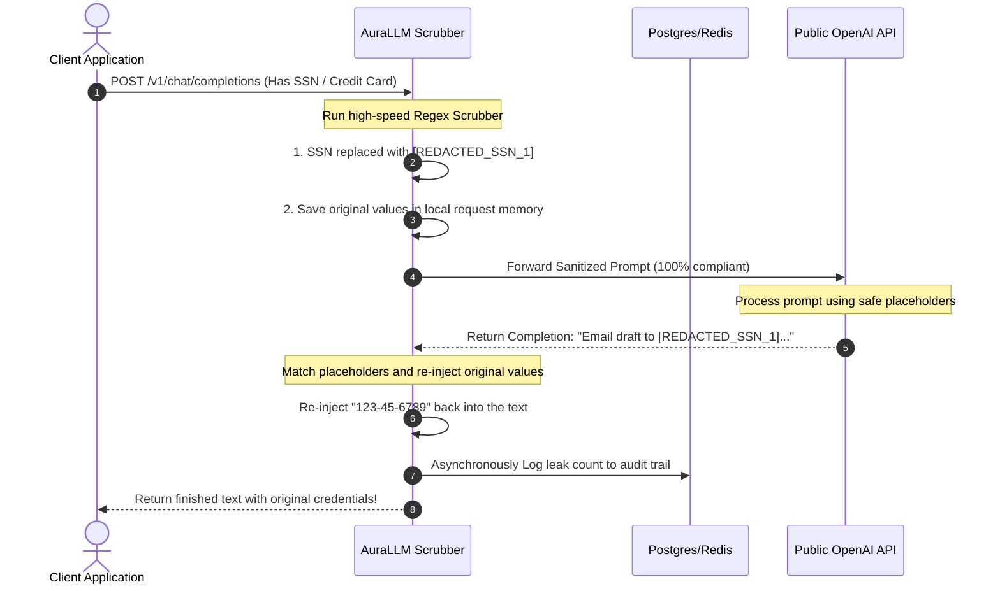

Corporate security policies often conflict with developer productivity. Employees accidentally paste client data, database passwords, or PII into AI prompts, exposing the company to major compliance violations.

AuraLLM enforces zero-friction, private sanitization locally on your servers before any data is sent upstream.

## Interactive Redaction Lifecycle

Watch the exact sequence of how AuraLLM processes a prompt, hashes high-risk secrets, contacts OpenAI, and securely restores the values on-the-fly inside your client connection:

---

## Local Compiled Regex Scrubber

When a prompt is sent through AuraLLM, the gateway intercepts the messages and scrubs four major sensitive records using fast, pre-compiled Go regular expressions:

| Target Record | Example Input | Place-holder |
| :--- | :--- | :--- |
| **Social Security Numbers** | `123-45-6789` | `[REDACTED_SSN_k]` |
| **Credit Cards** | `4111-2222-3333-4444` | `[REDACTED_CARD_k]` |
| **Email Addresses** | `support@bifrost.ai` | `[REDACTED_EMAIL_k]` |
| **Secrets & API Keys** | `sk-proj-abcde...` | `[REDACTED_SECRET_k]` |

### Auto Re-injection (Un-redaction)
For standard responses, when the upstream LLM returns a response referencing those placeholders, AuraLLM **automatically re-injects the original sensitive data back into the text** on-the-fly. 

The public cloud provider (OpenAI) **never saw the secret**, but your developer's application receives the completed text exactly as requested with **zero custom compliance code** written!
